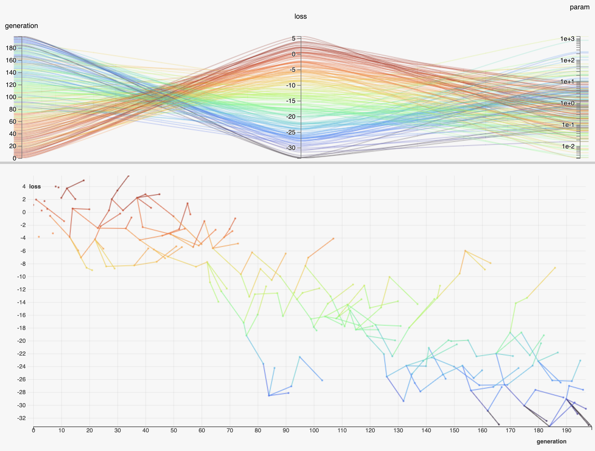

# HiPlot - High dimensional Interactive Plotting [](https://circleci.com/gh/fairinternal/hiplot)


HiPlot is a lightweight interactive visualization tool to help AI researchers discover correlations and patterns in high-dimensional data using parallel plots and other graphical ways to represent information.

Get started with:
```bash
pip install git+ssh://git@github.com/facebookresearch/hiplot.git
```

There are 2 modes to HiPlot:
- As a web-server (if your data is a CSV for instance)
- In a jupyter notebook (to visualize python data)


## HiPlot as a web-server
```bash
python -m hiplot
```
Run the command above and then access http://127.0.0.1:5005/ (*you need to forward the port 5005 to be able to access it from your machine if running remotely*)

## HiPlot in a Jupyter notebook
### Basic usage
Provide a list of dictionnaries to build a HiPlot `Experiment` that you can display
```python
# In a Jupyter notebook
import hiplot as hip
data = [{'dropout':0.1, 'lr': 0.001, 'loss': 10.0, 'optimizer': 'SGD'},
    {'dropout':0.15, 'lr': 0.01, 'loss': 3.5, 'optimizer': 'Adam'},
    {'dropout':0.3, 'lr': 0.1, 'loss': 4.5, 'optimizer': 'Adam'}]
hip.Experiment.from_iterable(data).display()
```
[see it live](https://facebookresearch.github.io/hiplot/_static/demo/demo_basic_usage.html)

It is also possible to load a CSV directly:
```python
import csv
import hiplot as hip
with open('/path/to/data.csv') as csvfile:
    hip.Experiment.from_iterable(csv.DictReader(csvfile)).display()
```

### Advanced use-cases
#### Enable X/Y plot
HiPlot can also display a X/Y graph if enabled explicitely as below. To do so, we must use the `Datapoint` class directly, and for each point specify the previous point `from_uid`. Multiple points can share the same parent - this is especially useful when representing evolving populations.
```python
import hiplot as hip
import random

exp = hip.Experiment().set_line_xy(x='generation', y='loss')
for i in range(100):
	dp = hip.Datapoint(
		uid=str(i),
		values={
			'generation': i,
			'param': 10 ** random.uniform(-1, 1),
			'loss': random.uniform(-5, 5)
	})
	if i > 10:
		from_parent = random.choice(exp.datapoints[-10:])
		dp.from_uid = from_parent.uid
		dp.values['loss'] += from_parent.values['loss']
		dp.values['param'] *= from_parent.values['param']
	exp.datapoints.append(dp)
exp.line_display.lines_thickness = 1.0  # Customize lines thickness. When below 0, the dots are not connected
exp.line_display.lines_opacity = 1.0  # Decrease this value if you have too many lines overlapping
exp.display()
```

[see it live](https://facebookresearch.github.io/hiplot/_static/demo/demo_line_xy.html)

#### Retrieve currently selected rows
*Only supported on Jupyter Notebook - does not work on Jupyter Lab*
```python
# In a Jupyter notebook cell
import hiplot as hip
data = [{'param': 1, 'loss': 10},
    {'param': 2, 'loss': 5}]
handler = hip.Experiment.from_iterable(data).display()

# In a different notebook cell (not supported for Jupyter Lab)
print(handler.get_selected())
```

#### Change column properties
```python
import hiplot as hip
data = [{'param': 1, 'loss': 10, 'hidden_field': 'value1', 'c': 'red'},
    {'param': 2, 'loss': 5, 'hidden_field': 'value2', 'c': 'black'}]
exp = hip.Experiment.from_iterable(data)
exp.parameters_definition['hidden_field'].parallel_plot_order = -1  # Hide
exp.parameters_definition['c'].colors = {'red': 'rgb(255, 0, 0)', 'black': 'rgb(0, 0, 0)'}
exp.parameters_definition['c'].parallel_plot_order = 0  # first column
exp.parameters_definition['loss'].type = 'numericlog'
exp.display()
```

[see it live](https://facebookresearch.github.io/hiplot/_static/demo/demo_change_column_properties.html)

## License
HiPlot is [MIT](LICENSE) licensed, as found in the [LICENSE](LICENSE) file.
