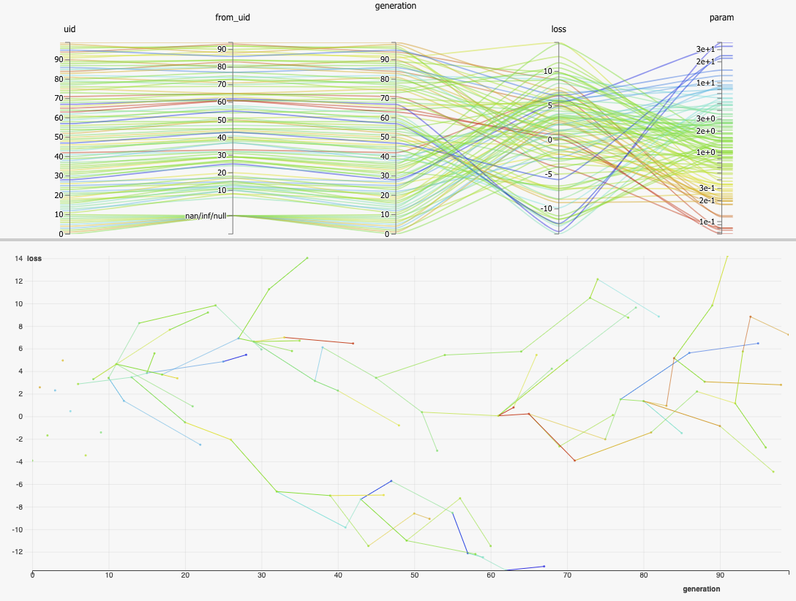
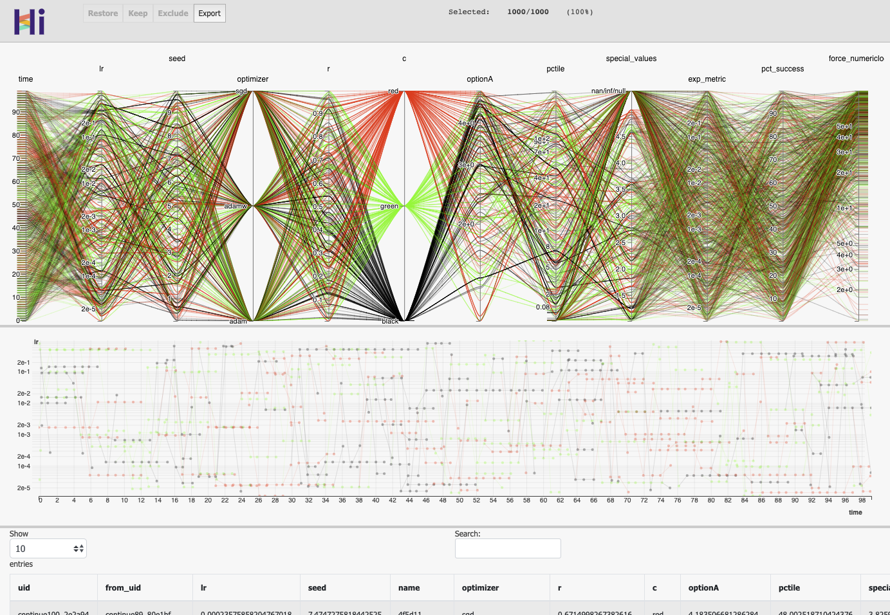

.. _customizeXp:

More about :class:`hiplot.Experiment`
=====================================

Drawing lines by connecting Datapoints
----------------------------------------

HiPlot has an XY graph. By default, it will simply display one dot per datapoint.
However, it is possible to make it draw lines or even trees by specifying offspring relationships.
In an :class:`hiplot.Experiment`, each point corresponds to a :class:`hiplot.Datapoint`, and each :class:`hiplot.Datapoint` has a unique :code:`uid`.
When a :class:`hiplot.Datapoint` has his :code:`from_uid` set to a parent's :code:`uid`, the XY graph will connect the parent and the child.

Multiple points can share the same parent - this is especially useful when representing evolving populations.

.. literalinclude:: ../hiplot/fetchers.py
    :start-after: DEMO_LINE_XY_BEGIN
    :end-before: DEMO_LINE_XY_END

`See it live <https://facebookresearch.github.io/hiplot/_static/demo/demo_line_xy.html>`_

Frontend rendering settings
----------------------------

It is possible to customize how the data is rendered:

* Either globally by attributing a :class:`hiplot.ValueType` to columns

.. literalinclude:: ../hiplot/test_experiment.py
    :start-after: EXPERIMENT_SETTINGS_SNIPPET1_BEGIN
    :end-before: EXPERIMENT_SETTINGS_SNIPPET1_END

* Or in the invididual components with :meth:`hiplot.Experiment.display_data`

.. literalinclude:: ../hiplot/test_experiment.py
    :start-after: EXPERIMENT_SETTINGS_SNIPPET2_BEGIN
    :end-before: EXPERIMENT_SETTINGS_SNIPPET2_END

Rendering of the experiment.
