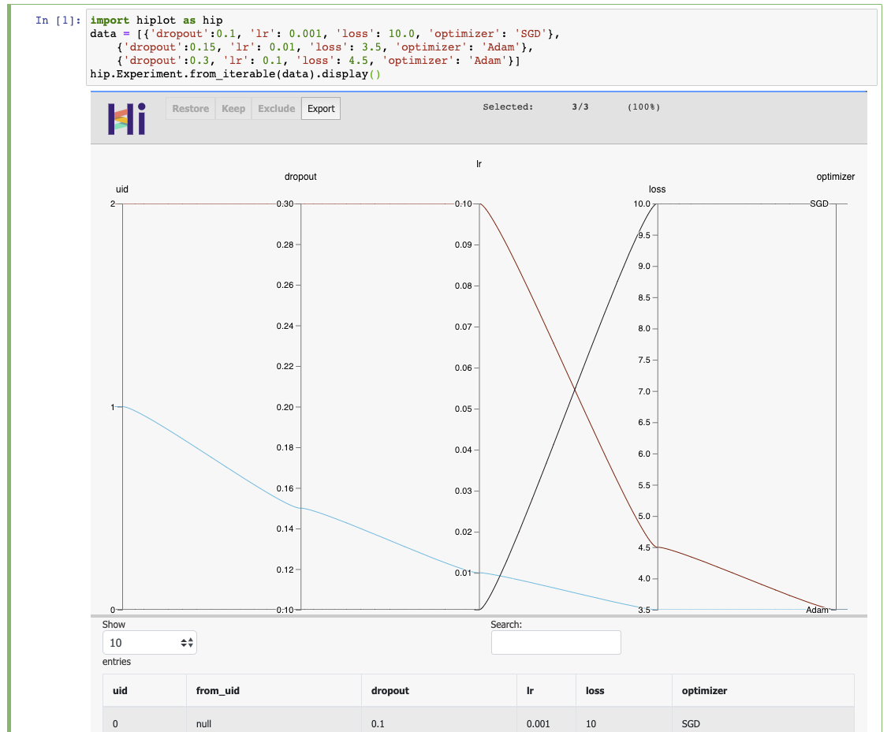

Getting started
====================

>>> pip install hiplot

Option 1: In an ipython notebook
--------------------------------

.. code-block:: python

    import hiplot as hip
    data = [{'dropout':0.1, 'lr': 0.001, 'loss': 10.0, 'optimizer': 'SGD'},
        {'dropout':0.15, 'lr': 0.01, 'loss': 3.5, 'optimizer': 'Adam'},
        {'dropout':0.3, 'lr': 0.1, 'loss': 4.5, 'optimizer': 'Adam'}]
    hip.Experiment.from_iterable(data).display()

.. _getStartedWebserver:

Option 2: HiPlot webserver
--------------------------

>>> hiplot

Then open your web browser in http://127.0.0.1:5005/.
In the web interface, you can enter an experiment URI - you can enter the path to a CSV file, or just type in :code:`demo`, or :code:`demo_line_xy` to see some basic examples.

.. note::
   By default, hiplot only listens on localhost, which prevents anyone else from seeing your experiments.
   To allow anyone to connect, use

   >>> hiplot --host 0.0.0.0

HiPlot webserver can do way more:

* you can share the URL to a colleague - it contains all the columns you have filtered, reordered during the session
* you can :ref:`tutoWebserverCompareXp`
* you can :ref:`tutoWebserverCustomFetcher`
