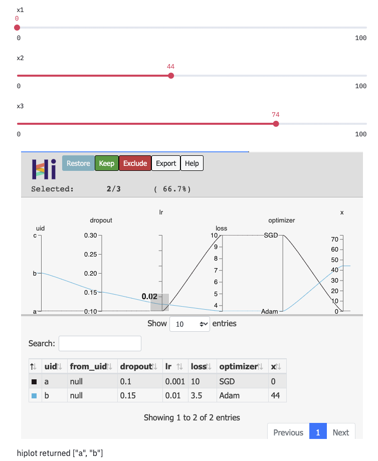

Getting started
====================

Installing
-----------------------

Python version
^^^^^^^^^^^^^^
HiPlot requires python version 3.6 or newer (you can check your python version with :code:`python3 --version`)

Python virtualenv
^^^^^^^^^^^^^^^^^
We advise that you create a virtualenv for HiPlot, if you don't use one already.

On Linux/MacOS
"""""""""""""""""
.. code-block:: bash

    # Create a virtualenv
    python3 -m venv venv_hiplot
    # Activate it
    . venv_hiplot/bin/activate

On Windows
""""""""""""""""""
.. code-block::

    py -3 -m venv venv_hiplot
    venv_hiplot\Scripts\activate

Install HiPlot
^^^^^^^^^^^^^^^^^^^^

Within the activated environment, use the following command to install HiPlot:

.. code-block:: bash

    pip install -U hiplot  # Or for conda users: conda install -c conda-forge hiplot

Congratulation, HiPlot is now ready to use! You can either:

* Use it to render python data in a notebook
* Or start it as a webserver to track, compare and visualize your experiments

Option 1: Use HiPlot in an ipython notebook
--------------------------------------------

Here we assume that we have a list of several datapoints.
HiPlot can only render :class:`hiplot.Experiment` objects, so we create one with :class:`hiplot.Experiment.from_iterable`.
Once we have created this object, we can display it with :class:`hiplot.Experiment.display`.

.. code-block:: python

    import hiplot as hip
    data = [{'dropout':0.1, 'lr': 0.001, 'loss': 10.0, 'optimizer': 'SGD'},
            {'dropout':0.15, 'lr': 0.01, 'loss': 3.5, 'optimizer': 'Adam'},
            {'dropout':0.3, 'lr': 0.1, 'loss': 4.5, 'optimizer': 'Adam'}]
    hip.Experiment.from_iterable(data).display()

.. raw:: html

    <iframe src="./_static/demo/demo_basic_usage.html?hip.PARALLEL_PLOT.height=300" height="700px" width="100%"></iframe>

**Learn more** in the tutorial: :ref:`tutoNotebook`

.. _getStartedWebserver:

Option 2: Use HiPlot webserver
-------------------------------

Within the activated environment, use the following command to run HiPlot server:

>>> hiplot

Then open your web browser in http://127.0.0.1:5005/.
In the web interface, you can enter an experiment URI - you can enter the path to a CSV file, or just type in :code:`demo`, or :code:`demo_line_xy` to see some basic examples.

.. note::
   By default, hiplot only listens on localhost, which prevents anyone else from seeing your experiments.
   To allow anyone to connect, use

   >>> hiplot --host 0.0.0.0

HiPlot webserver can do way more:

* you can share the URL to a colleague - it contains all the columns you have filtered, reordered during the session
* you can :ref:`tutoWebserverCompareXp`
* you can :ref:`tutoWebserverCustomFetcher`

Option 3: Create data-apps using Streamlit |streamlit_logo|
------------------------------------------------------------

`Streamlit <https://www.streamlit.io/>`_ allows data scientists and machine learning engineers to create beautiful, performant apps in pure Python.

This is the best way to create custom interfaces with HiPlot. For instance, you can perform dynamic actions
based on selected rows inside HiPlot (like plotting or displaying further information), and still have a sharable/deployable interface.

**Learn more** in the tutorial: :ref:`tutoStreamlit`

    *Here we let the user modify the dataset before displaying it*

.. |streamlit_logo| image:: ../assets/streamlit_logo.png
    :height: 30px

Option 4: Render standalone HTML files
-------------------------------------------------------
We provide a CLI tool ``hiplot-render`` to render HiPlot experiments into standalone HTML files, containing all HiPlot files, and your data.
To render a demo, or your own CSV file, use:

>>> hiplot-render demo > hiplot_demo.html
>>> hiplot-render /path/to/your/file.csv > hiplot.html

If your data is not already in the CSV format, you can either convert it to CSV, or see how to :ref:`tutoWebserverCustomFetcher`.
